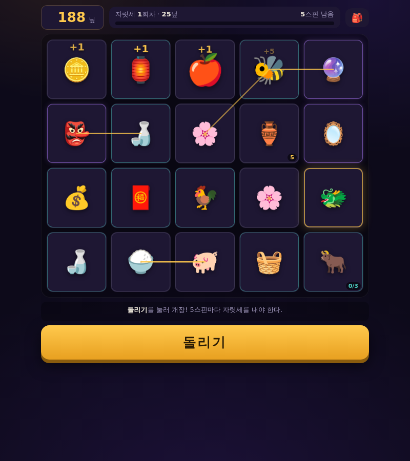

# 도깨비 야시장

**슬롯 빌더 로그라이크.** 도깨비들의 밤 시장에서 노점을 연다. 매 턴 슬롯이
돌아가고, 내가 수집한 심볼들이 무작위로 배치되어 서로 시너지를 일으키며
엽전을 쏟아낸다. 5스핀마다 자릿세 마감이 찾아온다 — 못 내면 폐업이다.

`index.html` 하나를 브라우저로 열면 바로 플레이됩니다. 설치·서버·로그인 없음.

## 코어 루프

**돌리기 → 시너지 폭발 → 3택1 드래프트 → 자릿세 마감** 의 반복.
자릿세 10회를 완납하면 시장의 주인이 되고, 이후 무한 모드가 열린다.

## 뭐가 깊은가

- **49종 심볼, 4등급 희귀도** — 생산 체인(달걀→병아리→닭), 성장 투자(잉어
  8스핀→용), 파괴 경제(항아리를 일부러 깨서 저장분 회수, 도깨비방망이가
  잡동사니를 금화로 연금), 오라·배율·복사·재발동 엔진까지.
- **덱 압축이 진짜 전략** — 보따리가 슬롯 20칸을 넘으면 매 스핀 일부만
  실린다. 아무거나 주우면 엔진이 묽어진다. 제거권을 어디에 쓸 것인가.
- **사신수 세트** — 청룡·백호·주작·현무. 넷이 모이면 매 스핀 +100닢 이상.
- **저주 시스템** — 빚문서(즉시 +20닢, 매 스핀 -2닢)를 받을 것인가?
  소금으로 정화하면 +8닢. 리스크를 사고파는 감각.
- **마지막 승부** — 자릿세를 못 내면 한 판에 단 한 번, 모든 지급 2배의
  올인 스핀이 주어진다. 여기서 갈린다.
- **유물 12종 · 업적 12종 · 해금 심볼 4종 · 도감** — localStorage 영구 저장.

## 밸런스 검증 (Monte Carlo)

같은 페이지의 순수 로직 코어를 헤드리스로 돌려 자동 플레이 정책 2종으로
밸런스를 검증했다 (`window.__dk.mc(n)`):

| 정책 | 200판 중앙값 | 승률 | 최고 |
|---|---|---|---|
| 탐욕 봇 (덱 압축 없음) | 자릿세 6회 | 0% | 9회 |
| 절제 봇 (시너지 드래프트 + 압축) | 자릿세 7회 | 2.7% | **10회 (승리)** |

같은 게임에서 판단력만으로 승률 0% → 2.7%가 갈린다 = 실력 게임이 맞다.
사람의 빌드 직관은 절제 봇보다 훨씬 좋으므로 실제 승률은 10~20%대로 추정 —
로그라이크의 표준적인 난이도 존이다.

## 도파민 설계 원칙

3중 가변 보상(배치×드래프트×시너지) + 지수 성장 관찰 + 마감 긴장/해소 +
수집 완성 욕구. 단, 전부 **게임 안에서만**: 과금 없음, 광고 없음, 실제
확률형 뽑기 없음, 에너지 없음, 출석 없음. 자세한 설계 근거와 심볼 전체
로스터는 [`DESIGN.md`](DESIGN.md) 참고.

## 조작

- **돌리기**: 버튼 클릭 또는 Space/Enter
- **🎒**: 보따리(인벤토리) — 심볼 제거는 여기서
- 심볼에 마우스를 올리면 하단에 설명 표시

## 기술

바닐라 JS 단일 파일(~2,000줄). WebAudio 신스(외부 에셋 0), 시드 가능한
RNG(mulberry32), DOM 독립적인 엔진 코어(헤드리스 시뮬레이션 지원),
localStorage 메타 저장.
