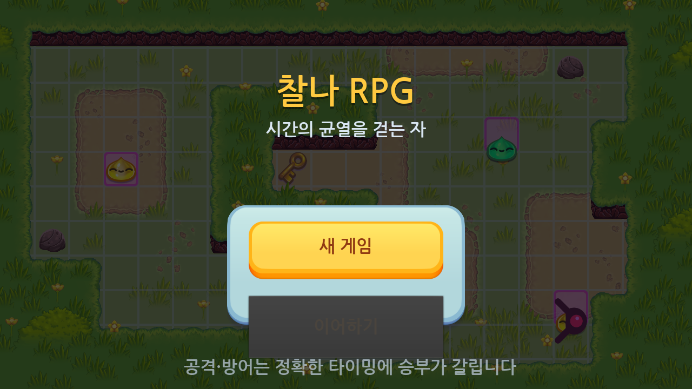
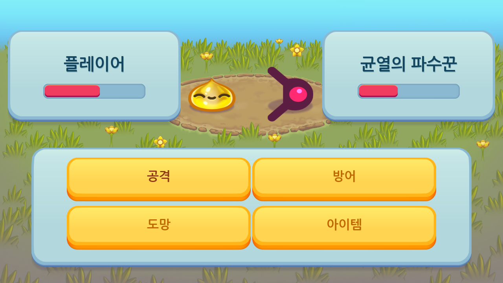
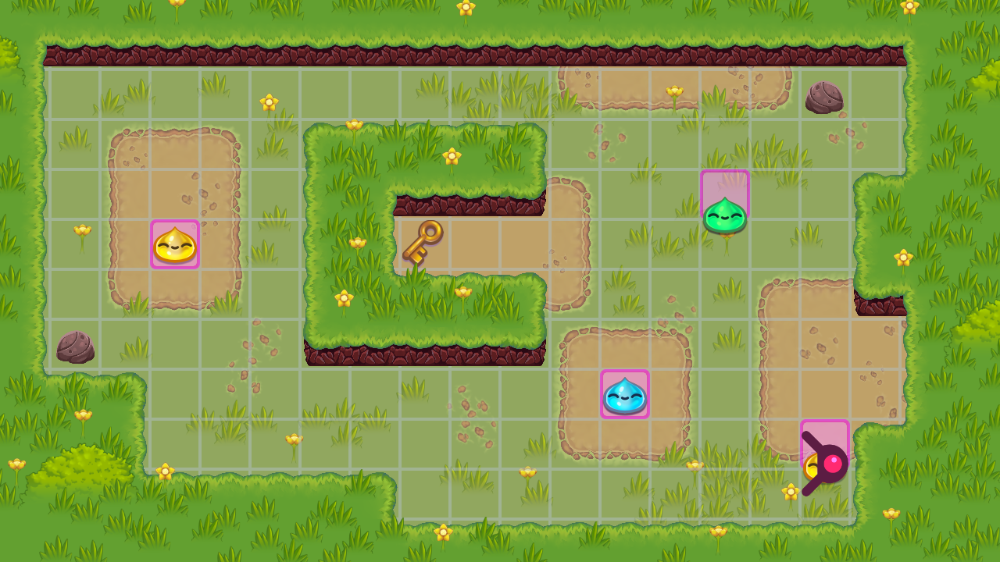

# 찰나 RPG

시간의 균열을 걷는 자의 이야기. **정확한 타이밍이 곧 힘이 되는** 턴제 JRPG.
찰나(CHALNA) 시리즈의 "정확히 그 순간에 맞춰라" 도파민 훅을 턴제 RPG 전투에
그대로 옮긴 작품입니다. Godot 3.5로 제작되었습니다.



## 핵심 메커닉 — 타이밍 판정 전투

공격·방어를 선택하면 게이지가 스윕되는 **타이밍 프롬프트**가 열립니다.
정확한 순간(금색 PERFECT 밴드)에 입력하면 1.5배 피해 / 방어 시 피해량
75% 감소, 그보다 넓은 청록색 GOOD 밴드는 표준 판정, 완전히 빗나가면
MISS로 효과가 크게 줄어듭니다. 자세한 수치는 [`DESIGN.md`](DESIGN.md)를
참고하세요.



## 특징

- 3단계 적 로스터: 슬라임(약) → 가시슬라임(중, 방어구 드롭) →
  균열의 파수꾼(보스, 무기 드롭 — 전용 스프라이트)
- 레벨/경험치, 체력, 골드, 인벤토리(회복 물약), 장비(무기/방어구) 시스템
- 패배해도 게임 오버 없이 절반 체력으로 즉시 재개 — 막다른 벽 없는 설계
- `이어하기` / `새 게임`을 지원하는 JSON 세이브 (`user://savegame.json`)
- 한글 다이얼로그와 UI (NanumGothic, OFL 라이선스)



## 실행 방법

Godot Engine **3.5.x**가 필요합니다.

```
godot3 --path rpg
```

또는 Godot Editor에서 이 폴더(`rpg/`)를 프로젝트로 열고 F5로 실행하세요.

## 조작

- 이동: 방향키 / WASD
- 타이밍 프롬프트 확정: Space / Enter / 마우스 클릭 / 터치

## 출처 및 라이선스

- 기반 코드: `godotengine/godot-demo-projects`의 `2d/role_playing_game` 데모
  (MIT 라이선스, 저장소 소유자의 명시적 동의 하에 사용). 원문 라이선스는
  [`LICENSE-godot-demo-projects.md`](LICENSE-godot-demo-projects.md) 참고.
- 폰트: NanumGothic (OFL, Google Fonts 배포본)
- 추가 크리처 스프라이트 일부: `2d/dodge_the_creeps` 데모 에셋(MIT)을
  변형해 보스 전용으로 사용

## 설계 문서

전체 설계 의도, 수치, 그리고 이번 빌드에서 의도적으로 축소한 범위
(4개 지역 → 1개 지역 등)에 대한 설명은 [`DESIGN.md`](DESIGN.md)를
참고하세요.
