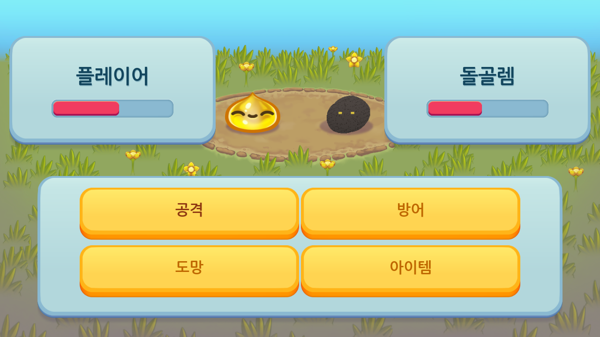
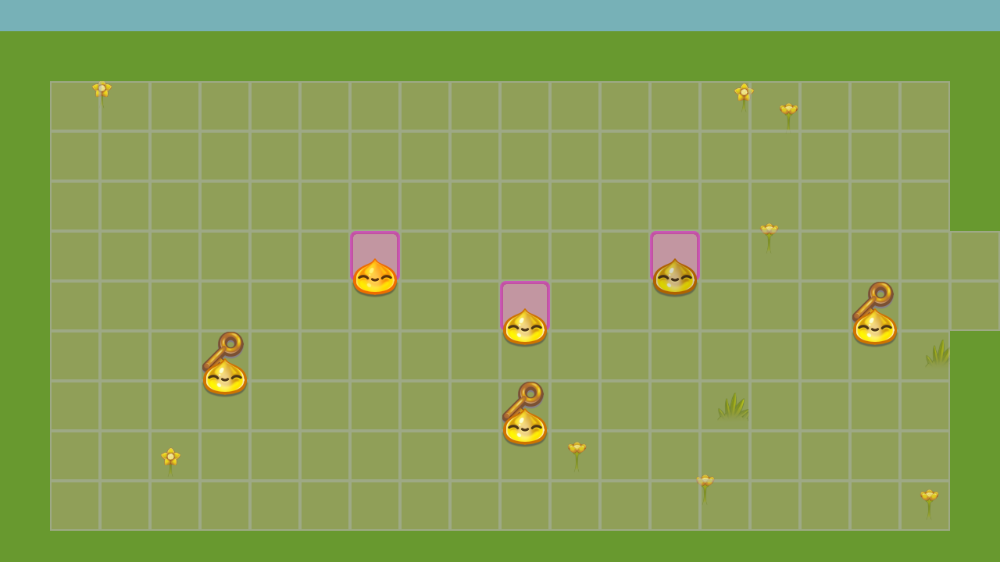
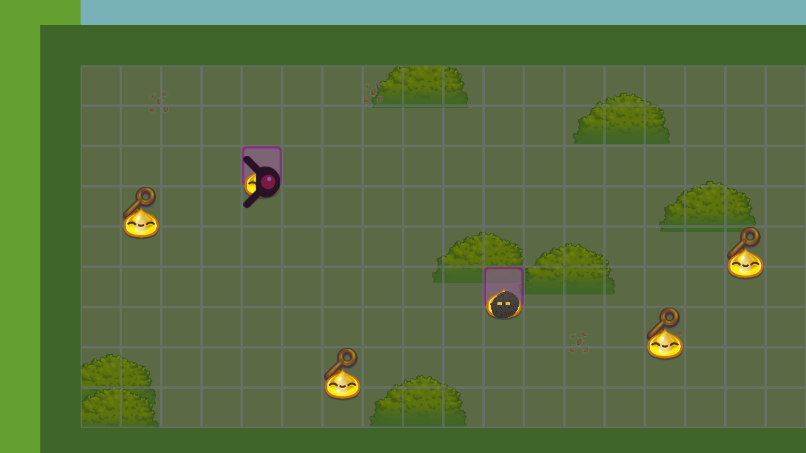
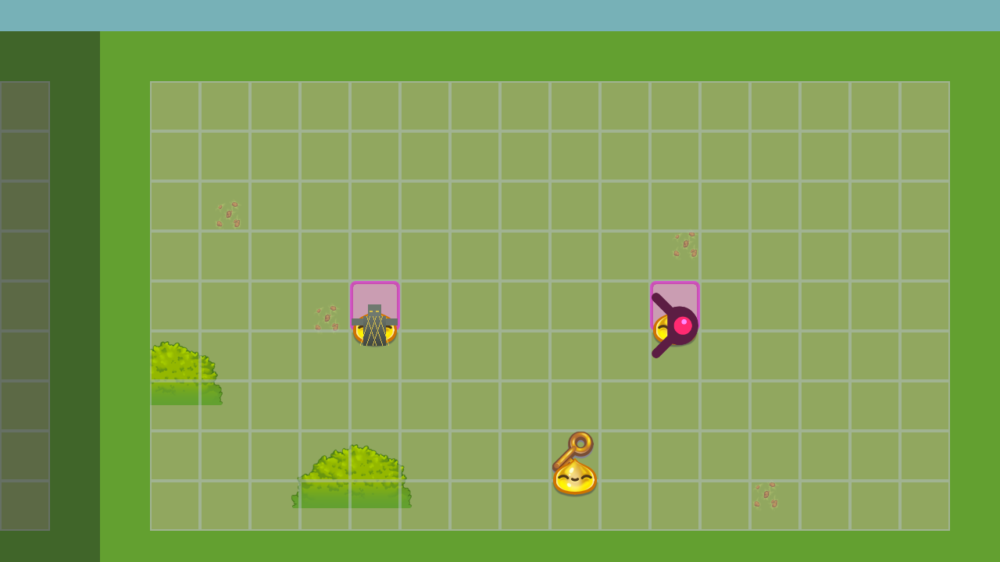

# 찰나 RPG

시간의 균열을 걷는 자의 이야기. **정확한 타이밍이 곧 힘이 되는** 턴제 JRPG.
찰나(CHALNA) 시리즈의 "정확히 그 순간에 맞춰라" 도파민 훅을 턴제 RPG 전투에
그대로 옮긴 작품입니다. Godot 3.5로 제작되었습니다.


## 핵심 메커닉 — 타이밍 판정 전투

공격·방어를 선택하면 게이지가 스윕되는 **타이밍 프롬프트**가 열립니다.
정확한 순간(금색 PERFECT 밴드)에 입력하면 1.5배 피해 / 방어 시 피해량
75% 감소, 그보다 넓은 청록색 GOOD 밴드는 표준 판정, 완전히 빗나가면
MISS로 효과가 크게 줄어듭니다. 보스전은 체력 65%·30% 시점마다 밴드가
좁아지고 스윕 속도가 빨라지는 **3단계 난이도 곡선**을 가집니다. 자세한
수치는 [`DESIGN.md`](DESIGN.md)를 참고하세요.



## 특징

- **하나로 이어진 지도, 4개 구역** — 로딩 화면 없이 카메라가 플레이어를
  따라 스크롤됩니다.
  - **마을** — 전투가 전혀 없는 안전 지대. 상인·원로 NPC, 시작 지점.
  - **숲길** — 첫 전투 구역: 슬라임(약) → 가시슬라임(중, 방어구 드롭).
  - **동굴** — 어두운 톤, 동굴박쥐·돌골렘(강, 방어구 드롭), 숨겨진 보물상자.
  - **폐허** — 폐허의 파수병 → **균열의 파수꾼** 보스(3단계 전투, 전용
    스프라이트, 무기 드롭).
- **퀘스트 게이트** — 구역 사이 통로는 실제로 막혀 있다가, 해당 조건(적
  처치·상자 개봉)을 만족하면 그 자리에서 즉시 열립니다. 별도의 열쇠
  아이템 없이 전투/탐험 그 자체가 조건이 됩니다.
- **상인 시스템** — 마을 NPC에게서 물약과 보급형 장비를 골드로 구매.
  필드 드롭보다 약하게 책정되어 있어 파밍의 가치를 해치지 않습니다.
- 레벨/경험치, 체력, 골드, 인벤토리(회복 물약), 장비(무기/방어구) 시스템
- 패배해도 게임 오버 없이 절반 체력으로 즉시 재개 — 막다른 벽 없는 설계
- `이어하기` / `새 게임`을 지원하는 JSON 세이브 (`user://savegame.json`)
- 한글 다이얼로그와 UI (NanumGothic, OFL 라이선스)

| 마을 | 동굴 | 폐허 |
|---|---|---|
|  |  |  |

## 실행 방법

Godot Engine **3.5.x**가 필요합니다.

```
godot3 --path rpg
```

또는 Godot Editor에서 이 폴더(`rpg/`)를 프로젝트로 열고 F5로 실행하세요.

## 조작

- 이동: 방향키 / WASD
- 타이밍 프롬프트 확정: Space / Enter / 마우스 클릭 / 터치

## 출처 및 라이선스

- 기반 코드: `godotengine/godot-demo-projects`의 `2d/role_playing_game` 데모
  (MIT 라이선스, 저장소 소유자의 명시적 동의 하에 사용). 원문 라이선스는
  [`LICENSE-godot-demo-projects.md`](LICENSE-godot-demo-projects.md) 참고.
- 폰트: NanumGothic (OFL, Google Fonts 배포본)
- 추가 크리처 스프라이트: `2d/dodge_the_creeps` 데모 에셋(MIT)을 변형(보스),
  나머지 신규 적(동굴박쥐/돌골렘/폐허의 파수병)은 새 손그림 없이 Godot의
  `Image` API로 직접 합성·생성했습니다.

## 설계 문서

전투 수치, 구역별 설계 의도, 게이트/상점/보스 3단계 전투의 구현 방식은
[`DESIGN.md`](DESIGN.md)를 참고하세요.
